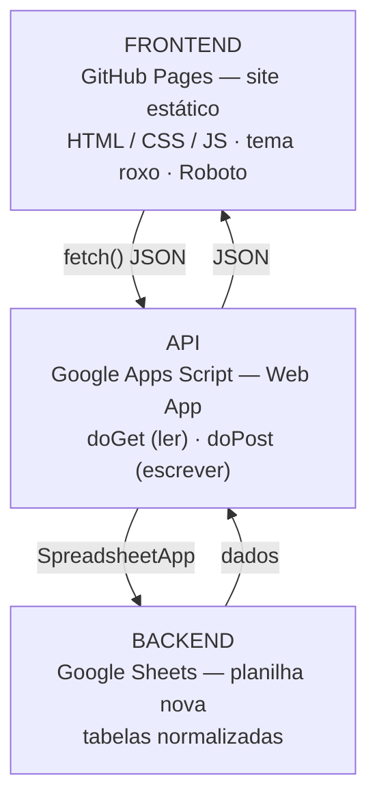
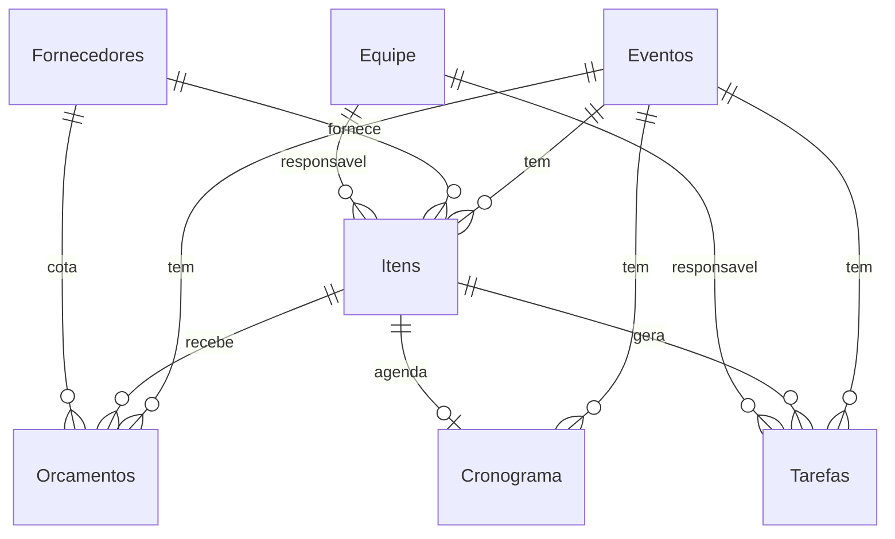

# EXP-Backstage — Documento de Design

> Sistema web de gestão da produção de eventos da EXP.
> **Status:** rascunho para validação — nada de código ainda.
> **Data:** 2026-05-21

---

## 1. Visão geral

O EXP-Backstage substitui o controle por planilha solta por um sistema próprio:
um **frontend** que a equipe acessa pelo navegador, conversando com um **backend**
que continua sendo o Google Sheets — só que agora organizado como banco de dados.

O objetivo é cobrir o fluxo de produção descrito no `claude.md`:

```
Briefing → Orçamento → Aprovação → Contratações → Execução → Operação → Pós-evento
```

...com tarefas, negociações (orçamentos), cronograma de montagem e checklists.

### Decisões já validadas (2026-05-21)

| Tema | Decisão |
|---|---|
| Escopo da v1 | Focar no evento **CIA 2026**, mas com o backend já modelado para multi-evento |
| Papel do site | **Leitura + edição** desde a v1 (grava de volta no Sheets) |
| Backend | **Planilha nova e normalizada**, migrando os dados da planilha atual |
| Tema visual | Roxo `#6b3e92`, fonte **Roboto** |

---

## 2. Arquitetura técnica

Três camadas, todas gratuitas e sem servidor para manter:



### Por que essa pilha

- **Google Sheets como backend** — a equipe já domina, dá para abrir e corrigir
  na mão se algo der errado, tem histórico de versões nativo e custo zero.
- **Apps Script como API** — é a única forma de o site escrever no Sheets com
  segurança (a chave da planilha nunca vai para o navegador). Roda dentro do
  Google, sem servidor para manter.
- **GitHub Pages** — hospedagem estática grátis, deploy por `git push`.

### Trade-offs que você precisa conhecer (decisões de arquiteto)

- **CORS no Apps Script** — requisições `POST` do navegador disparam *preflight*
  se o `Content-Type` for `application/json`. Solução padrão: enviar como
  `text/plain` e fazer `JSON.parse` no `doPost`. A resposta sai via
  `ContentService` com MIME JSON.
- **Sem rotas REST nativas** — o Web App só tem `doGet` e `doPost`. Vamos rotear
  por um campo `action` no payload (ex.: `action: "listarTarefas"`).
- **IDs estáveis (UUID)** — toda linha terá uma coluna `id` (UUID). Nunca usar o
  número da linha como identidade — ordenar/inserir no Sheets embaralha as linhas.
- **Concorrência** — vários produtores escrevendo ao mesmo tempo. Toda escrita
  passa por `LockService` para serializar e evitar sobrescrita.
- **Cache de leitura** — `CacheService` (até 6h) para não reler a planilha
  inteira a cada request.
- **Cotas** — execução de 6 min por chamada e ~90 min/dia de runtime na conta
  consumidor. Para uma equipe de ~15 pessoas, sobra folga.
- **Deploy estável** — criar **uma** "implantação" e sempre usar *Editar* para
  publicar novas versões, mantendo a mesma URL.

### Decisões técnicas em aberto (preciso da sua opinião)

1. **Autenticação.** O site no GitHub Pages é público. Duas opções:
   - **(Recomendado) Google Sign-In (GIS) + lista branca de e-mails.** A pessoa
     entra com a conta Google, o frontend manda o token, o Apps Script confere o
     e-mail contra uma lista de autorizados. Sem senhas, casa com as contas
     Google que a equipe já usa.
   - **Senha/token compartilhado.** Mais rápido de fazer, porém fraco — um site
     estático não guarda segredo de verdade. Serve só como protótipo.

2. **Stack do frontend.** Recomendo **JavaScript puro com ES Modules, sem
   bundler** — GitHub Pages serve os arquivos direto, sem build, código legível
   para você co-programar. Estrutura: `api.js` (camada de acesso), `state.js`
   (estado), e um arquivo por tela. Se quisermos reatividade leve depois, dá para
   acrescentar Alpine.js via CDN. O Gantt usaria a biblioteca **Frappe Gantt**
   (MIT, sem dependências).

---

## 3. Esquema do backend (planilha normalizada)

Cada aba abaixo é uma **tabela**. A primeira linha é o cabeçalho; cada linha
seguinte é um registro. Tudo é amarrado por `evento_id` e por IDs de relação.

### `Eventos`
| Coluna | Tipo | Observação |
|---|---|---|
| id | UUID | chave |
| nome | texto | ex.: "Copa Inter Atléticas 2026" |
| tipo_evento | texto | para relatórios futuros |
| cidade | texto | |
| local | texto | ex.: "Centro Park" |
| data_inicio | data | |
| data_fim | data | |
| descricao | texto | |
| fase | enum | Briefing / Orçamento / Aprovação / Contratações / Execução / Operação / Pós-evento / Finalizado |
| responsavel_id | UUID | → `Equipe` |
| status | enum | Ativo / Arquivado |
| created_at / updated_at | timestamp | |

### `Equipe` (junção de PRODUTORES + CRACHÁS)
| Coluna | Tipo |
|---|---|
| id | UUID |
| nome_completo | texto |
| nome_cracha | texto |
| funcao | texto (Head Geral, Planejamento, Arquiteta...) |
| area | texto |
| email | texto |
| telefone | texto |
| foto_url | texto |
| ativo | booleano |

### `Fornecedores`
| Coluna | Tipo |
|---|---|
| id | UUID |
| nome | texto |
| categoria | texto (Estrutura, Som e Luz, Tendas...) |
| contato_nome | texto |
| telefone | texto |
| email | texto |
| observacoes | texto |

### `Itens` — o coração (PLANILHA DE TRABALHO normalizada)
| Coluna | Tipo | Observação |
|---|---|---|
| id | UUID | |
| evento_id | UUID | → `Eventos` |
| categoria | enum | ESTRUTURA GERAL / ESTRUTURA EVENTUAL / STAFF / TÉCNICA |
| setor | texto | opcional |
| item | texto | nome do item/estrutura |
| descritivo | texto | |
| observacao | texto | |
| fornecedor_id | UUID | → `Fornecedores` (o escolhido) |
| responsavel_id | UUID | → `Equipe` |
| status_contrato | enum | Pendente / Em andamento / Concluído |
| status_producao | enum | Pendente / Em andamento / Concluído |
| status_pagamento | enum | Pendente / Em andamento / Concluído |
| qntd / freq / unidade / qntd_total | número / texto | |
| valor_unitario / valor_total | número | |
| prazo_execucao | data | |
| score_risco | número | 0–100 (mantém o conceito da planilha atual) |
| created_at / updated_at | timestamp | |

### `Orcamentos` (cotações — várias por item)
| Coluna | Tipo | Observação |
|---|---|---|
| id | UUID | |
| evento_id | UUID | → `Eventos` |
| item_id | UUID | → `Itens` (o que está sendo cotado) |
| fornecedor_id | UUID | → `Fornecedores` |
| descritivo_orcado | texto | |
| observacao | texto | |
| qntd_total / valor_unitario / valor_total | número | |
| status | enum | Pendente / Aprovado / Recusado |
| responsavel_id | UUID | → `Equipe` |
| created_at / updated_at | timestamp | |

> Regra de negócio: quando um orçamento é **Aprovado**, seu fornecedor e valor
> são copiados para o `Item` correspondente.

### `Tarefas` (CHECKLIST + "Pipe de Tarefas")
| Coluna | Tipo | Observação |
|---|---|---|
| id | UUID | |
| evento_id | UUID | → `Eventos` |
| fase | enum | a fase do fluxo a que pertence |
| categoria | texto | 00. MONTAGEM / ESTRUTURAL / ... |
| titulo | texto | |
| descricao | texto | a "ação" |
| item_id | UUID | opcional → `Itens` |
| fornecedor_id | UUID | opcional → `Fornecedores` |
| responsavel_id | UUID | → `Equipe` |
| data_criacao / prazo | data | |
| status | enum | Não iniciado / Em andamento / Concluído |
| origem | enum | Manual / Automática |
| created_at / updated_at | timestamp | |

### `Cronograma` (montagens — fonte do Gantt)
| Coluna | Tipo | Observação |
|---|---|---|
| id | UUID | |
| evento_id | UUID | → `Eventos` |
| setor | texto | |
| servico | texto | |
| item_id | UUID | opcional → `Itens` |
| fornecedor_id / responsavel_id | UUID | |
| tipo | enum | Montagem / Desmontagem |
| data_inicio / data_fim | data | |
| status | enum | Não iniciado / Em andamento / Concluído / Travado |
| observacao | texto | |

> Mudança importante: a planilha atual desenha o Gantt como uma **grade de
> colunas de dias**. No backend novo guardamos só `data_inicio`/`data_fim` e o
> **frontend desenha** o Gantt. Bem mais simples de manter.

### `Config` (aba de apoio)
Listas de valores para os menus suspensos (fases, categorias, status, setores,
unidades, funções), a lista branca de e-mails autorizados e parâmetros gerais.

### Relações



> **Fora do escopo da v1:** os descritivos técnicos detalhados (BOX, GRADIL,
> ELÉTRICA, PISO etc.) e a aba `Pagamentos`. Ficam como referência/anexo e viram
> módulo numa fase posterior, para não inflar a primeira entrega.

---

## 4. Módulos do frontend

| Módulo | O que faz | Espelha na planilha atual |
|---|---|---|
| **Dashboard** | Visão macro: % de conclusão, dias para o evento, contadores por status, valor orçado × contratado, alertas de prazo | topo da aba CHECKLIST |
| **Tarefas / Checklist** | Lista + kanban por status, filtro por responsável, prazos | CHECKLIST |
| **Itens** | Tabela central, filtros por categoria/status/responsável, edição dos 3 status | PLANILHA DE TRABALHO |
| **Orçamentos** | Cotações por item, comparar fornecedores, aprovar/recusar | ORÇAMENTOS |
| **Cronograma** | Gantt visual das montagens, gerado das datas | CRONOGRAMA |
| **Fornecedores** | Cadastro de fornecedores | (espalhado hoje) |
| **Equipe** | Produtores, funções, crachás | PRODUTORES + CRACHÁS |

A "landing page" hospedada no GitHub Pages é a porta de entrada: login →
dashboard do evento.

---

## 5. Migração dos dados da CIA 2026

A planilha "CIA 2026 - PLANEJAMENTO.xlsx" continua rodando o evento real (faltam
~14 dias) **sem interrupção**. Em paralelo, um script lê essa planilha e popula o
backend novo:

- `PRODUTORES` + `CRACHÁS` → `Equipe`
- `PLANILHA DE TRABALHO` → `Itens` (e gera os `Fornecedores`)
- `ORÇAMENTOS` → `Orcamentos`
- `CHECKLIST` → `Tarefas`
- `CRONOGRAMA` → `Cronograma`
- cabeçalho do `CHECKLIST` → o registro em `Eventos`

Assim começamos a desenvolver a API e o frontend já com **dados reais** para
testar, sem mexer no que está no ar.

---

## 6. Roadmap — por onde começamos

| Fase | Entrega | O que envolve |
|---|---|---|
| **0. Validação** | Este documento aprovado | Você revisa e ajusta o que for preciso |
| **1. Backend + migração** | Planilha-backend pronta e populada | Criar as abas/tabelas; script de migração da CIA 2026 |
| **2. API** | Apps Script Web App no ar | `doGet`/`doPost`, autenticação, `LockService`, cache, endpoints |
| **3. Frontend base** | Site no GitHub Pages com Dashboard + Tarefas | Layout, tema roxo + Roboto, primeira tela com escrita |
| **4. Demais módulos** | Itens, Orçamentos, Cronograma/Gantt, Fornecedores, Equipe | Uma tela por vez |
| **5. Automações** | Notificações e tarefas automáticas | Gatilhos por fase, alertas de prazo, e-mails (claude.md §3) |
| **6. Pós-evento** | Relatórios e polimento | Relatório geral, de material e de operação; responsividade |

### Recomendação de primeiro passo concreto

**Começar pela Fase 1 — a planilha-backend e a migração.** Tudo depende do
esquema de dados; com os dados reais da CIA 2026 já normalizados, API e frontend
nascem com conteúdo de verdade para testar. É o alicerce.

---

## 7. O que preciso de você para seguir

1. Aprovar (ou ajustar) o **esquema do backend** da seção 3.
2. Escolher a **autenticação** (seção 2 — recomendo Google Sign-In).
3. Confirmar a **stack do frontend** (seção 2 — recomendo JS puro, sem bundler).
4. Confirmar que começamos pela **Fase 1**.

Nada será criado antes do seu OK.
